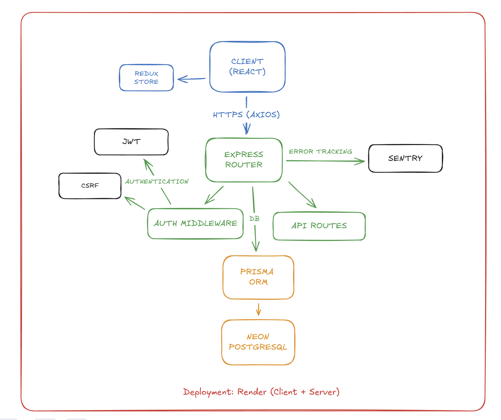

<div align="center">

# 🏥 HealEase

### A Modern Healthcare Community Platform

**Empowering patients and healthcare providers through seamless communication and knowledge sharing**

[](https://healease-client.onrender.com)
[](https://github.com/BarcDevs/HealEase--client)
[](https://github.com/BarcDevs/HealEase--server)


</div>

---

## 📋 Overview

HealEase is a full-stack healthcare community platform built with modern web technologies and cloud-native principles. Currently a working POC being modernized for production deployment with enterprise-grade architecture and DevOps practices.

**Status:** 🚧 Active Development | Production-Ready POC

## ✨ Key Features

- 🔐 **Secure Authentication** - JWT-based auth with Google OAuth integration and CSRF protection
- 💬 **Community Forum** - Rich text posts, nested comments, and upvote/downvote system
- 🏷️ **Content Organization** - Category-based filtering and tag management
- 👤 **User Profiles** - Personalized profiles with activity tracking
- 📱 **Responsive Design** - Mobile-first UI built with TailwindCSS and shadcn/ui
- ⚡ **Real-time Updates** - Optimized performance with Million.js compiler
- 🛡️ **Type Safety** - End-to-end TypeScript with Zod validation

## 🛠️ Tech Stack

### **Frontend**
```
React 19              → UI Library
TypeScript 5          → Type Safety
Vite 7                → Build Tool & Dev Server
TanStack Router       → File-based Routing
Redux Toolkit         → State Management
Axios                 → HTTP Client with Interceptors
shadcn/ui             → Component Library (Radix UI)
TailwindCSS 4         → Styling Framework
React Hook Form       → Form Management
Zod                   → Schema Validation
Million.js            → React Performance Optimization
Sentry                → Error Tracking & Monitoring
```

### **Backend**
```
Express               → Web Framework
TypeScript            → Type Safety
Prisma 7              → ORM with Type Generation
PostgreSQL (Neon)     → Serverless Database
JWT                   → Authentication
Bcrypt                → Password Hashing
```

### **DevOps & Infrastructure**
```
Render                → Cloud Hosting (Frontend + Backend)
GitHub                → Version Control & CI/CD
ESLint + Prettier     → Code Quality & Formatting
```

## 🏗️ Architecture & Design Principles

This project follows industry-standard practices and clean architecture:

- **RESTful API Design** - Predictable, resource-based endpoints
- **SOLID Principles** - Single responsibility, dependency inversion throughout codebase
- **Separation of Concerns** - Clear boundaries between routing, business logic, and data layers
- **Type Safety First** - Full TypeScript coverage with strict mode enabled
- **Configuration Management** - Environment-based config with validation
- **Error Handling** - Centralized error handling with Sentry integration
- **Security Best Practices** - CSRF protection, secure HTTP-only cookies, parameterized queries

## 📸 Screenshots


## 🚀 Local Development

### Prerequisites
- Node.js 18+
- npm or yarn
- PostgreSQL database

### Frontend Setup

```bash
# Clone the repository
git clone https://github.com/BarcDevs/HealEase--client.git
cd HealEase--client

# Install dependencies
npm install

# Create environment file
cp .env.example .env.local

# Required environment variables:
# VITE_SERVER_URL=http://localhost:4000
# VITE_HOSTNAME=http://localhost:5173
# VITE_SERVER_API_VERSION=v1
# VITE_SENTRY_DSN=your_sentry_dsn
# VITE_SENTRY_REPLAYS_SESSION_SAMPLE_RATE=0.1

# Start development server
npm run dev
```

### Backend Setup

```bash
# Clone the backend repository
git clone https://github.com/BarcDevs/HealEase--server.git
cd HealEase--server

# Install dependencies
npm install

# Set up environment variables
cp .env.example .env

# Run database migrations
npx prisma migrate dev

# Seed the database (optional)
npm run seed

# Start the server
npm run dev
```

Visit `http://localhost:5173` to see the app in action.

## 🔄 Roadmap

### **Phase 1: Production Hardening** (In Progress)
- [ ] Comprehensive unit and integration tests
- [ ] Performance optimization and lazy loading
- [ ] Enhanced error boundaries and fallback UI
- [ ] Accessibility improvements (WCAG 2.1 AA)

### **Phase 2: Architecture Modernization** (Q2 2025)
- [ ] Migrate backend to **NestJS** for better scalability
- [ ] Implement GraphQL API alongside REST
- [ ] Add real-time features with WebSockets
- [ ] Redis caching layer for performance

### **Phase 3: DevOps & Cloud-Native** (Q3 2025)
- [ ] **Kubernetes** deployment with Helm charts
- [ ] CI/CD pipeline with GitHub Actions
- [ ] Terraform for infrastructure as code
- [ ] Docker containerization with multi-stage builds
- [ ] Monitoring with Prometheus + Grafana
- [ ] Log aggregation with ELK stack

### **Phase 4: Feature Expansion**
- [ ] Appointment booking system
- [ ] Role-based access control (RBAC)
- [ ] Direct messaging between users
- [ ] Email notifications system
- [ ] Advanced search with Elasticsearch
- [ ] Mobile app with React Native

## 📊 Project Highlights

- **Type-Safe Codebase**: 100% TypeScript coverage with strict mode
- **Modern Stack**: Latest stable versions of React, Node.js, and tooling
- **Developer Experience**: Hot reload, ESLint, comprehensive type checking
- **Scalable Architecture**: Designed for microservices migration
- **Production Ready**: Error monitoring, performance tracking, CSRF protection
- 
## 📊 Architecture Diagram



## 🤝 Contributing

This is a portfolio project, but feedback and suggestions are welcome! Feel free to open an issue or reach out.

## 📝 License

This project is private and intended for portfolio demonstration.

---

<div align="center">

**Built by Bar | Full-Stack Developer | Open to Opportunities**

[](https://www.linkedin.com/in/barcohendev)
[](https://bardevs.com)
[](mailto:barcprodevelopments@gmail.com)

*Passionate about building scalable, user-centric applications with modern cloud-native technologies.*

</div>
