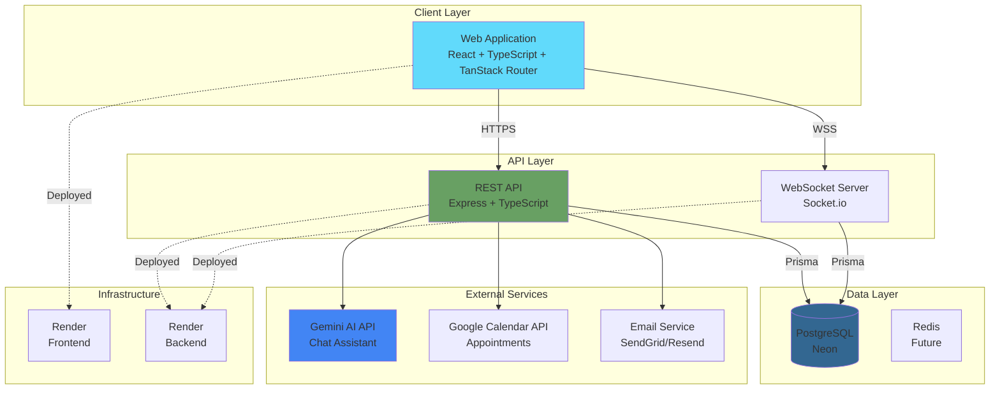
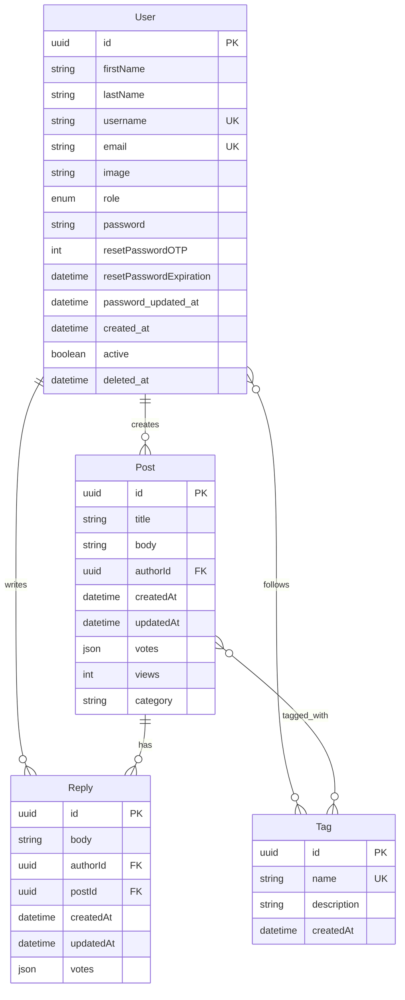
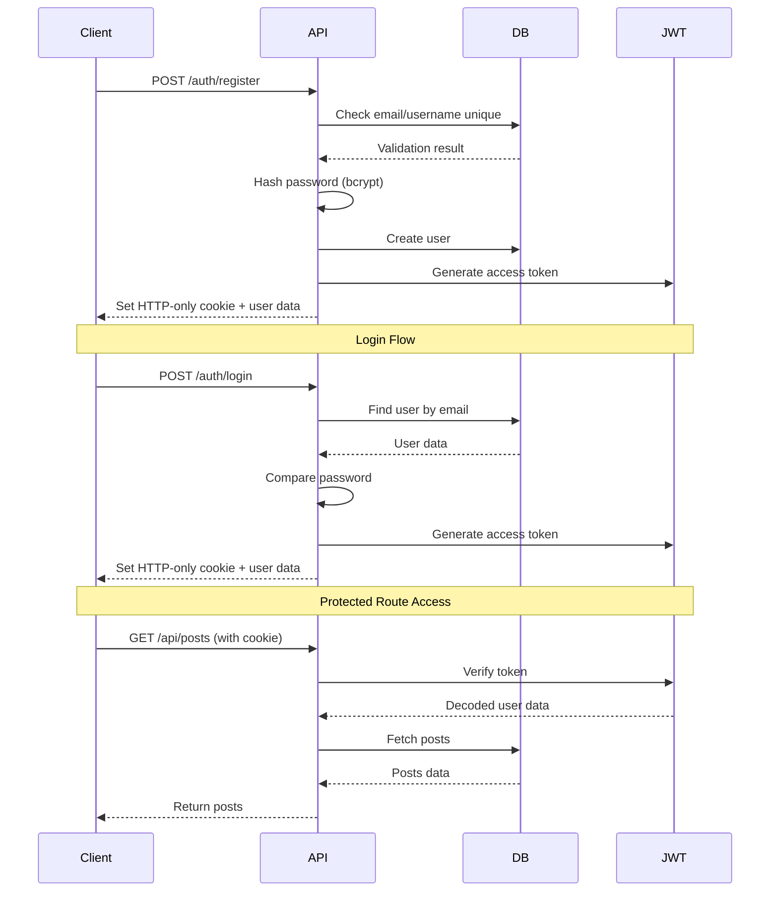
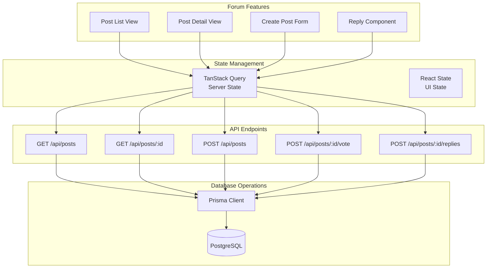
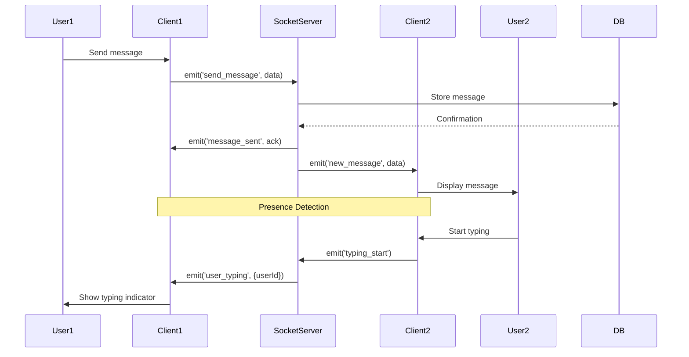
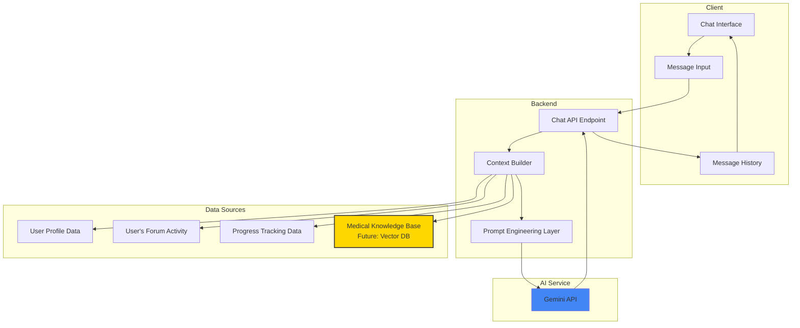
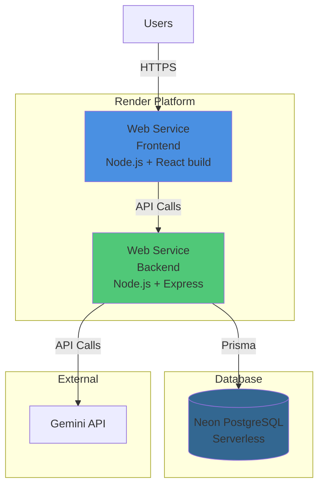
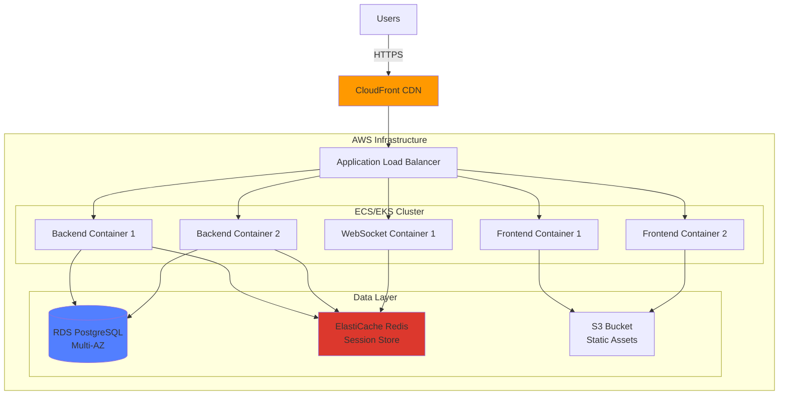

# HealEase - Technical Product Requirements Document

**Version:** 0.9.0 (POC → MVP Transition)  
**Last Updated:** January 2026  
**Project Type:** Healthcare Recovery Support Platform  
**Target Audience:** Startups & Small Product Companies

---

## 📋 Table of Contents

1. [Project Overview](#project-overview)
2. [Technical Architecture](#technical-architecture)
3. [Current Tech Stack](#current-tech-stack)
4. [Development Roadmap](#development-roadmap)
5. [Feature Specifications](#feature-specifications)
6. [Success Metrics](#success-metrics)
7. [Technical Debt & Improvements](#technical-debt--improvements)

---

## 🎯 Project Overview

### Vision Statement

HealEase is a comprehensive healthcare platform designed to support patients during recovery from injuries or serious
illnesses. It addresses the critical gap in post-discharge care by centralizing recovery information, facilitating peer
support, and providing AI-powered assistance.

### Core Problem

**Problem:** Lack of centralized platform for recovery information and peer support leads to:

- Prolonged recovery times
- Patient isolation and emotional distress
- Unnecessary hospital readmissions
- Overburdened medical staff with repetitive questions

**Solution:** A Reddit-style community platform with:

- Peer-to-peer support forum
- Real-time chat capabilities
- AI-powered recovery assistant
- Progress tracking tools
- Expert consultation scheduling

### Target Users

**Primary:** Patients recovering from injuries or serious illnesses  
**Secondary:** Caregivers, family members, healthcare professionals

### Success Metrics

**POC Success Criteria:**

- ✅ Authentication system functional
- ✅ Forum with CRUD operations working
- ✅ Basic UI/UX implemented
- ✅ Deployed to production (Render)

**MVP Success Criteria:**

- 100+ registered users
- 50+ daily active users
- 200+ forum posts
- 10+ expert consultations booked
- <2s average page load time
- 99% uptime

**Business Success Criteria:**

- Partnership with 1+ healthcare organization
- Positive user feedback (4+/5 rating)
- Portfolio piece drives 5+ employer interviews

---

## 🏗️ Technical Architecture

> **Note:** A visual architecture diagram is available in the repository. The Mermaid diagrams below provide text-based
> alternatives that render automatically in GitHub.

### High-Level System Architecture



### Current Database Schema (v0.9.0)



### Authentication Flow



### Feature Architecture - Forum System



### Feature Architecture - Real-Time Chat (Planned)



### Feature Architecture - AI Assistant (Planned)



### Deployment Architecture - Current (v0.9.0)



### Deployment Architecture - Future (Post-MVP)



---

## 💻 Current Tech Stack

### Frontend

- **Framework:** React 18+ with TypeScript
- **Routing:** TanStack Router (Type-safe routing)
- **Styling:** Tailwind CSS v4 + Shadcn UI components
- **State Management:** TanStack Query (Server state) + React Context (UI state)
- **Form Handling:** React Hook Form + Zod validation
- **HTTP Client:** Axios
- **Build Tool:** Vite
- **Deployment:** Render

### Backend

- **Runtime:** Node.js 20+
- **Framework:** Express.js with TypeScript
- **ORM:** Prisma
- **Database:** Neon PostgreSQL (Serverless)
- **Authentication:** JWT with HTTP-only cookies
- **Validation:** Zod
- **Real-time:** Socket.io (Planned)
- **API Documentation:** Swagger/TSOA (Planned)
- **Deployment:** Render

### External Services

- **AI:** Gemini API (Free tier)
- **Calendar:** Google Calendar API (Planned)
- **Email:** SendGrid/Resend (Planned)

### Development Tools

- **IDE:** WebStorm
- **Version Control:** Git + GitHub (Separate repos)
- **Code Quality:** ESLint + Prettier
- **Testing:** Jest + React Testing Library (Planned)
- **Containerization:** Docker (Planned)

### Infrastructure

- **Hosting:** Render (Free tier)
- **Database:** Neon PostgreSQL (Serverless)
- **CI/CD:** GitHub Actions (Planned)
- **Monitoring:** Basic Render metrics (Future: Sentry/DataDog)

---

## 🗺️ Development Roadmap

### Phase 0: POC Completion (v0.9.0 → v1.0.0)

**Timeline:** Current - 2 weeks  
**Focus:** Polish existing features, prepare for MVP launch

#### 🔄 Critical for v1.0.0 Launch (In Progress)

- [ ] **`Post.tsx`** - Populate replies on loader (currently not loading properly)
- [ ] **`routes/_forum/forum/index.tsx`** - Add validation (Zod schema for form inputs)
- [ ] **`app.tsx`** - Fix Sentry integration and re-enable error tracking

#### 📋 Important Polish (Todo)

- [ ] **`Replies.tsx`** - Add sort button (by date, votes, etc.)
- [ ] **`$postId_.edit`** - Pass post data through route context (better architecture)
- [ ] **`PostCard.tsx`** - Resolve conditional types on React component (TypeScript best practice)

#### 🚀 Nice-to-Have (Post-v1.0.0)

- [ ] **`GoogleLoginButton.tsx`** - Add Google OAuth login → **Planned for v1.2.0**
- [ ] **`OtpForm.tsx`** - Implement 2FA for login → **Planned for v2.0.0**
- [ ] **`ForgotPasswordForm.tsx`** - Add forgot password logic → **Planned for v1.1.0**
- [ ] **`server`** - Add Docker for easier development setup → **Planned for v1.4.0**

#### ✅ Completed (POC)

- [x] User authentication (register, login, logout)
- [x] JWT-based auth with HTTP-only cookies
- [x] Forum post creation with title, body, category
- [x] Post viewing and filtering by category
- [x] Reply functionality (nested comments)
- [x] Voting system (upvote/downvote on posts and replies)
- [x] Tag system (create, follow, filter by tags)
- [x] Basic user profiles (view profile, post history)
- [x] Deployment to Render (frontend + backend)
- [x] Tailwind CSS v4 migration
- [x] Cross-origin cookie configuration (CORS + credentials)
- [x] Database schema with Prisma (User, Post, Reply, Tag models)
- [x] Basic responsive design

---

### Phase 1: MVP Core Features (v1.0.0 → v1.3.0)

**Timeline:** Month 1-3 (12 weeks, ~4 hrs/day)  
**Focus:** Deliver core value proposition - community support + AI assistance

#### Sprint 1-2: Enhanced Forum (v1.1.0) - 3 weeks

**Goal:** Make the forum production-ready and feature-rich

##### 📋 Todo

- [ ] **Search Functionality**
    - Full-text search across posts and replies
    - Filter by category, tags, author
    - Sort by: relevance, date, votes, views
    - Search history for logged-in users

- [ ] **User Profiles Enhancement**
    - Profile page with post history
    - User statistics (posts, replies, karma)
    - Avatar upload (Cloudinary/S3)
    - Bio and recovery story section
    - Follow/unfollow users (future)

- [ ] **Forum UX Improvements**
    - Infinite scroll pagination
    - Post preview on hover
    - Rich text editor (TipTap/Lexical)
    - Image upload in posts
    - Draft saving (localStorage)
    - Share post functionality

- [ ] **Notification System (Basic)**
    - Reply notifications
    - Mention notifications (@username)
    - Email notifications toggle

- [ ] **Moderation Tools**
    - Report post/reply
    - Admin dashboard for content moderation
    - User ban system (soft delete)

##### 🔄 In Progress

- [ ] Currently in POC completion phase

##### ✅ Done

- None yet (starting after POC)

---

#### Sprint 3-4: Real-Time Chat (v1.2.0) - 3 weeks

**Goal:** Enable private, real-time communication between users

##### 📋 Todo

- [ ] **Socket.io Integration**
    - WebSocket server setup
    - Connection handling and reconnection logic
    - Room management (private chats)

- [ ] **Chat Backend**
    - Message model in Prisma schema
    - Conversation model (many-to-many users)
    - Message persistence in PostgreSQL
    - Message pagination (load history)
    - Typing indicators
    - Online/offline status

- [ ] **Chat Frontend**
    - Chat list view (conversations)
    - Chat window component
    - Message bubbles with timestamps
    - Real-time message updates
    - Typing indicators UI
    - Unread message badges
    - Emoji picker integration

- [ ] **Chat Features**
    - Start conversation from user profile
    - Message reactions (future)
    - File sharing (future)
    - Search within conversation

##### 🔄 In Progress

- [ ] Not started

##### ✅ Done

- None yet

---

#### Sprint 5-6: AI Assistant (v1.3.0) - 3 weeks

**Goal:** Integrate Gemini AI for recovery support and Q&A

##### 📋 Todo

- [ ] **Gemini API Integration**
    - API key configuration
    - Rate limiting (free tier constraints)
    - Error handling for API failures
    - Retry logic with exponential backoff

- [ ] **Chat Backend**
    - AI chat message storage
    - Conversation context management
    - System prompt engineering
    - User context injection (profile data)

- [ ] **AI Features - Phase 1 (Stateless)**
    - General injury/recovery Q&A
    - Emotional support responses
    - Exercise suggestions
    - Pain management tips
    - Safety disclaimers in responses

- [ ] **Chat Frontend**
    - AI chat interface (separate from user chat)
    - Streaming responses (SSE or WebSocket)
    - "AI is typing" indicator
    - Conversation history
    - Clear conversation button
    - Example prompts/suggestions

- [ ] **Prompt Engineering**
    - System prompt for medical context
    - Tone and empathy guidelines
    - Response length optimization
    - Disclaimer templates
    - Conversation history summarization

- [ ] **Safety & Compliance**
    - Medical disclaimer on first interaction
    - "Consult a doctor" triggers
    - Content filtering (no dangerous advice)
    - User consent for AI usage

##### 🔄 In Progress

- [ ] Not started

##### ✅ Done

- None yet

---

#### Sprint 7-8: Production Readiness (v1.3.0 → v1.4.0) - 2 weeks

**Goal:** Security, documentation, and deployment improvements

##### 📋 Todo

- [ ] **Security Hardening**
    - Rate limiting (express-rate-limit)
    - Input validation on all endpoints
    - SQL injection prevention (Prisma handles)
    - XSS protection (sanitize user input)
    - CSRF protection
    - Helmet.js middleware
    - Security headers configuration

- [ ] **Error Handling**
    - Global error handler
    - Structured error responses
    - Error logging (future: Sentry)
    - User-friendly error messages

- [ ] **API Documentation**
    - Swagger/OpenAPI spec
    - TSOA integration
    - Endpoint descriptions
    - Request/response examples
    - Authentication documentation

- [ ] **Internationalization (i18n)**
    - i18next setup
    - English translations
    - Hebrew translations
    - RTL support (Tailwind config)
    - Language switcher UI
    - Date/time localization

- [ ] **Docker Setup**
    - Dockerfile for backend
    - Dockerfile for frontend
    - docker-compose.yml for local dev
    - Multi-stage builds
    - .dockerignore configuration

- [ ] **Testing Foundation**
    - Jest configuration
    - Unit tests for utilities
    - API endpoint tests (Supertest)
    - React component tests (RTL)
    - Test coverage reporting

- [ ] **Code Quality**
    - ESLint rules enforcement
    - Prettier configuration
    - Pre-commit hooks (Husky)
    - CI/CD pipeline (GitHub Actions)

##### 🔄 In Progress

- [ ] Not started

##### ✅ Done

- None yet

---

### Phase 2: MVP Extended Features (v1.4.0 → v1.8.0)

**Timeline:** Month 4-6 (12 weeks, ~4 hrs/day)  
**Focus:** Progress tracking, appointments, content library

#### Sprint 9-10: Basic Progress Tracking (v1.5.0) - 3 weeks

**Goal:** Enable users to track recovery metrics

##### 📋 Todo

- [ ] **Database Schema**
    - ProgressEntry model (pain, mood, notes)
    - MedicationReminder model
    - ProgressGoal model

- [ ] **Pain Tracking**
    - Daily pain level (1-10 scale)
    - Pain location (body map)
    - Pain type (sharp, dull, burning, etc.)
    - Pain triggers (optional notes)

- [ ] **Medication Management**
    - Medication list (name, dosage, frequency)
    - Medication schedule
    - Reminder notifications
    - Medication history log
    - Missed dose tracking

- [ ] **Progress Dashboard**
    - Weekly/monthly view
    - Pain trend chart (Chart.js/Recharts)
    - Medication adherence chart
    - Export data as CSV/PDF

- [ ] **Goals & Milestones**
    - Set recovery goals
    - Track goal progress
    - Celebrate achievements (gamification prep)

##### 🔄 In Progress

- [ ] Not started

##### ✅ Done

- None yet

---

#### Sprint 11-12: Appointment Scheduling (v1.6.0) - 3 weeks

**Goal:** Enable consultation booking with experts

##### 📋 Todo

- [ ] **Database Schema**
    - Expert model (profile, specializations)
    - Appointment model (date, type, status, price)
    - ExpertAvailability model (time slots)

- [ ] **Expert Onboarding**
    - Expert registration flow
    - Profile setup (credentials, bio, specializations)
    - Availability management
    - Pricing configuration (free vs. paid)

- [ ] **Appointment Booking - Core**
    - View expert list with filters
    - Expert profile page
    - Calendar view of availability
    - Book appointment flow
    - Appointment confirmation (email)
    - Calendar integration prep (Google Calendar API)

- [ ] **Appointment Management**
    - User's upcoming appointments
    - Expert's appointment dashboard
    - Reschedule functionality
    - Cancel appointment
    - Appointment status tracking

- [ ] **Payment System (Optional - Feature Flag)**
    - Stripe Checkout integration
    - Payment intent creation
    - Webhook handling
    - Transaction history
    - Refund logic (cancellations)
    - Expert payout tracking

- [ ] **Notifications**
    - Appointment confirmation email
    - Reminder emails (24h, 1h before)
    - Cancellation notifications

##### 🔄 In Progress

- [ ] Not started

##### ✅ Done

- None yet

---

#### Sprint 13-14: Content Library (v1.7.0) - 2 weeks

**Goal:** Provide educational resources and recovery guides

##### 📋 Todo

- [ ] **Database Schema**
    - Article model (title, body, category, author)
    - ContentTag model
    - UserBookmark model

- [ ] **Content Management**
    - Admin CMS for articles
    - Rich text editor for content
    - Image upload for articles
    - Video embed support (YouTube/Vimeo)

- [ ] **Content Library Features**
    - Article listing with filters
    - Article detail page
    - Search articles
    - Bookmark articles
    - Reading progress tracking
    - Related articles suggestion

- [ ] **Content Categories**
    - Injury types and treatment
    - Physical therapy exercises
    - Mental health resources
    - Nutrition and recovery
    - Equipment usage guides
    - Success stories

- [ ] **Curated External Resources**
    - Link aggregation (high-quality sources)
    - Resource rating system
    - User-submitted resources (moderated)

##### 🔄 In Progress

- [ ] Not started

##### ✅ Done

- None yet

---

#### Sprint 15-16: Polish & Optimization (v1.8.0) - 2 weeks

**Goal:** Performance optimization and bug fixes

##### 📋 Todo

- [ ] **Performance Optimization**
    - Image lazy loading
    - Code splitting
    - Bundle size optimization
    - API response caching
    - Database query optimization
    - CDN setup for static assets

- [ ] **SEO Optimization**
    - Meta tags for all pages
    - Open Graph tags
    - Sitemap generation
    - robots.txt
    - Schema.org markup

- [ ] **Analytics Setup**
    - Google Analytics / Plausible
    - Event tracking (user actions)
    - Conversion funnel analysis
    - User behavior insights

- [ ] **Bug Fixes & Refinement**
    - User-reported issues
    - Edge case handling
    - Cross-browser testing
    - Mobile responsiveness fixes
    - Accessibility improvements (WCAG)

##### 🔄 In Progress

- [ ] Not started

##### ✅ Done

- None yet

---

### Phase 3: Post-MVP & Scaling (v2.0.0+)

**Timeline:** Month 7+ (Ongoing)  
**Focus:** Advanced features, scaling, and migration to NestJS

#### v2.0.0: NestJS Migration

**Goal:** Refactor backend for better scalability and maintainability

##### 📋 Backlog

- [ ] **Migration Strategy**
    - Feature-by-feature migration plan
    - Run Express and NestJS side-by-side
    - Gradual traffic shifting
    - Rollback strategy

- [ ] **NestJS Setup**
    - Project scaffolding
    - Module structure design
    - Dependency injection setup
    - Microservices preparation

- [ ] **Code Migration**
    - Auth module
    - Forum module
    - Chat module
    - AI module
    - Appointment module

- [ ] **Testing & Validation**
    - Integration tests
    - Performance comparison
    - Load testing
    - Production deployment

---

#### v2.1.0: Advanced AI Features

**Goal:** Context-aware AI with personalization

##### 📋 Backlog

- [ ] **Vector Database Integration**
    - Pinecone/Supabase Vector setup
    - Embedding generation pipeline
    - Semantic search implementation

- [ ] **AI Phase 2: Personalized Assistant**
    - User context integration
    - Conversation history analysis
    - Forum post reference
    - Progress data integration

- [ ] **AI Phase 3: Recovery Coach**
    - Proactive suggestions
    - Pattern recognition
    - Recovery plan generation
    - Goal tracking integration

- [ ] **Medical Knowledge Base**
    - Curated medical content ingestion
    - RAG (Retrieval-Augmented Generation)
    - Citation and source linking
    - Expert review system

---

#### v2.2.0: Family/Caregiver Access

**Goal:** Enable family members to support patient recovery

##### 📋 Backlog

- [ ] **Permission System**
    - Granular access control
    - Patient approval workflow
    - Access level management (view, edit)

- [ ] **Caregiver Features**
    - View patient progress
    - Medication reminder visibility
    - Appointment notifications
    - Emergency contact system

- [ ] **Privacy & Security**
    - HIPAA compliance considerations
    - Audit logging
    - Access revocation
    - Data encryption at rest

---

#### v2.3.0: Gamification System

**Goal:** Increase engagement through achievements and rewards

##### 📋 Backlog

- [ ] **Achievement System**
    - Badge types (recovery milestones, community engagement)
    - Achievement triggers
    - Notification system
    - Badge display on profile

- [ ] **Reputation System**
    - Karma points for helpful posts
    - User levels/ranks
    - Top contributors leaderboard
    - Expert badges for verified professionals

- [ ] **Engagement Mechanics**
    - Daily login streaks
    - Milestone celebrations
    - Community challenges
    - Recovery story sharing rewards

---

#### v2.4.0: Mobile Application

**Goal:** Native mobile experience (React Native)

##### 📋 Backlog

- [ ] React Native setup
- [ ] Mobile UI/UX redesign
- [ ] Push notifications
- [ ] Offline mode
- [ ] App store deployment

---

#### v2.5.0: AWS Migration & Kubernetes

**Goal:** Production-grade infrastructure

##### 📋 Backlog

- [ ] **AWS Infrastructure**
    - VPC and networking setup
    - RDS PostgreSQL (Multi-AZ)
    - ElastiCache Redis
    - S3 for file storage
    - CloudFront CDN
    - Route 53 DNS

- [ ] **Containerization**
    - Docker optimization
    - Kubernetes manifests
    - Helm charts
    - CI/CD pipeline updates

- [ ] **Monitoring & Observability**
    - CloudWatch metrics
    - Application logging (ELK stack)
    - APM (Application Performance Monitoring)
    - Error tracking (Sentry)
    - Uptime monitoring

- [ ] **Scaling Strategy**
    - Horizontal pod autoscaling
    - Database read replicas
    - Load balancer optimization
    - Caching strategy (Redis)

---

## 📊 Feature Specifications

### Forum System (Current + Planned)

**Current Features (v0.9.0):**

- Create, read, update, delete posts
- Category filtering
- Tag system
- Reply to posts
- Upvote/downvote system
- View counter

**Planned Enhancements (v1.1.0):**

- Full-text search
- Advanced filtering (by author, date, popularity)
- Rich text editor with image upload
- User mentions (@username)
- Post bookmarking
- Draft saving
- Share functionality
- Infinite scroll pagination

**Database Schema Updates:**

```prisma
model Post {
  // ... existing fields

  // New fields for v1.1.0
  bookmarkedBy   User[]    @relation("BookmarkedPosts")
  mentionedUsers User[]    @relation("PostMentions")
  images         String[]  // Array of image URLs
  isDraft        Boolean   @default(false)
  publishedAt    DateTime? 
  editHistory    Json?     // Track edits for transparency
}

model User {
  // ... existing fields

  // New fields for v1.1.0
  bookmarkedPosts Post[]  @relation("BookmarkedPosts")
  mentionedIn     Post[]  @relation("PostMentions")
  karma           Int     @default(0) // Reputation score
  bio             String? 
  avatar          String? 
}
```

---

### Real-Time Chat System (v1.2.0)

**Features:**

- Private 1-on-1 conversations
- Real-time message delivery (Socket.io)
- Message persistence
- Typing indicators
- Online/offline status
- Unread message badges
- Message history pagination
- Start chat from user profile

**Technical Implementation:**

```typescript
// Socket.io Events
socket.on('send_message', (data) => {
    // Store message in DB
    // Emit to recipient if online
    // Update unread count
})

socket.on('typing_start', (data) => {
    // Broadcast typing indicator
})

socket.on('typing_stop', (data) => {
    // Remove typing indicator
})

socket.on('user_online', (userId) => {
    // Update user status
    // Broadcast to friends/contacts
})
```

**Database Schema:**

```prisma
model Conversation {
  id           String    @id @default(uuid())
  participants User[]    
  messages     Message[] 
  createdAt    DateTime  @default(now())
  updatedAt    DateTime  @updatedAt
}

model Message {
  id             String       @id @default(uuid())
  content        String       
  sender         User         @relation(fields: [senderId], references: [id])
  senderId       String       
  conversation   Conversation @relation(fields: [conversationId], references: [id])
  conversationId String       
  readBy         User[]       @relation("ReadMessages")
  createdAt      DateTime     @default(now())
  deleted        Boolean      @default(false)
}
```

---

### AI Assistant (v1.3.0)

**Phase 1 Features (Stateless Q&A):**

- General injury/recovery information
- Emotional support responses
- Exercise suggestions
- Pain management tips
- Medication information (general)
- Safety disclaimers

**System Prompt Strategy:**

```typescript
const SYSTEM_PROMPT = `
You are HealEase AI, a compassionate recovery assistant designed to support patients during their healing journey.

Guidelines:
1. Always provide empathetic, supportive responses
2. Include medical disclaimers for health advice
3. Encourage users to consult healthcare professionals for serious concerns
4. Focus on evidence-based recovery practices
5. Keep responses concise (2-3 paragraphs max)
6. Use encouraging, positive language
7. Never provide specific medical diagnoses

Context:
- User is recovering from: {injury_type}
- Recovery stage: {recovery_stage}
- Pain level: {current_pain_level}
`
```

**API Integration:**

```typescript
// Gemini API Call
const response = await fetch('https://generativelanguage.googleapis.com/v1beta/models/gemini-pro:generateContent', {
    method: 'POST',
    headers: {
        'Content-Type': 'application/json',
        'x-goog-api-key': GEMINI_API_KEY
    },
    body: JSON.stringify({
        contents: [{
            parts: [{ text: userMessage }]
        }],
        systemInstruction: SYSTEM_PROMPT,
        safetySettings: [
            { category: 'HARM_CATEGORY_MEDICAL', threshold: 'BLOCK_MEDIUM_AND_ABOVE' }
        ]
    })
})
```

**Database Schema:**

```prisma
model AIConversation {
  id        String      @id @default(uuid())
  user      User        @relation(fields: [userId], references: [id])
  userId    String      
  messages  AIMessage[] 
  createdAt DateTime    @default(now())
  updatedAt DateTime    @updatedAt
}

model AIMessage {
  id             String         @id @default(uuid())
  conversation   AIConversation @relation(fields: [conversationId], references: [id])
  conversationId String         
  role           String         // 'user' | 'assistant'
  content        String         
  tokens         Int?           // Track usage for free tier limits
  createdAt      DateTime       @default(now())
}
```

---

### Progress Tracking (v1.5.0)

**Features:**

- Daily pain level tracking
- Medication schedule and reminders
- Mood tracking
- Recovery goals
- Progress visualization (charts)
- Export data (CSV/PDF)

**Database Schema:**

```prisma
model ProgressEntry {
  id           String   @id @default(uuid())
  user         User     @relation(fields: [userId], references: [id])
  userId       String   
  date         DateTime @default(now())
  painLevel    Int      // 1-10 scale
  painType     String?  // sharp, dull, burning, etc.
  painLocation String?  // body part
  mood         Int?     // 1-10 scale
  notes        String?  
  createdAt    DateTime @default(now())
}

model Medication {
  id        String               @id @default(uuid())
  user      User                 @relation(fields: [userId], references: [id])
  userId    String               
  name      String               
  dosage    String               
  frequency String               // "daily", "twice_daily", "as_needed"
  reminders MedicationReminder[] 
  active    Boolean              @default(true)
  createdAt DateTime             @default(now())
}

model MedicationReminder {
  id           String     @id @default(uuid())
  medication   Medication @relation(fields: [medicationId], references: [id])
  medicationId String     
  time         DateTime   
  taken        Boolean    @default(false)
  takenAt      DateTime?  
  skipped      Boolean    @default(false)
  createdAt    DateTime   @default(now())
}

model RecoveryGoal {
  id          String    @id @default(uuid())
  user        User      @relation(fields: [userId], references: [id])
  userId      String    
  title       String    
  description String?   
  targetDate  DateTime? 
  completed   Boolean   @default(false)
  completedAt DateTime? 
  createdAt   DateTime  @default(now())
}
```

---

### Appointment Scheduling (v1.6.0)

**Features:**

- Expert profiles (credentials, specializations)
- Availability calendar
- Appointment booking flow
- Free and paid consultations
- Email confirmations and reminders
- Reschedule/cancel functionality
- Google Calendar integration (optional)
- Stripe payment integration (feature flag)

**Database Schema:**

```prisma
enum AppointmentType {
  FREE
  PAID
}

enum AppointmentStatus {
  PENDING
  CONFIRMED
  COMPLETED
  CANCELLED
  RESCHEDULED
}

model Expert {
  id              String               @id @default(uuid())
  user            User                 @relation(fields: [userId], references: [id])
  userId          String               @unique
  specializations String[]             
  credentials     String               
  bio             String?              
  hourlyRate      Float?               
  availability    ExpertAvailability[] 
  appointments    Appointment[]        
  verified        Boolean              @default(false)
  createdAt       DateTime             @default(now())
}

model ExpertAvailability {
  id        String  @id @default(uuid())
  expert    Expert  @relation(fields: [expertId], references: [id])
  expertId  String  
  dayOfWeek Int     // 0-6 (Sunday-Saturday)
  startTime String  // "09:00"
  endTime   String  // "17:00"
  active    Boolean @default(true)
}

model Appointment {
  id          String            @id @default(uuid())
  patient     User              @relation("PatientAppointments", fields: [patientId], references: [id])
  patientId   String            
  expert      Expert            @relation(fields: [expertId], references: [id])
  expertId    String            
  type        AppointmentType   
  status      AppointmentStatus @default(PENDING)
  scheduledAt DateTime          
  duration    Int               @default(30) // minutes
  price       Float?            
  notes       String?           

  // Payment fields (optional)
  stripePaymentId String?
  paymentStatus   String? // 'pending' | 'completed' | 'refunded'

  createdAt   DateTime  @default(now())
  updatedAt   DateTime  @updatedAt
  cancelledAt DateTime? 
  completedAt DateTime? 
}
```

**Booking Flow:**

1. User browses expert list
2. Selects expert and views availability
3. Chooses time slot
4. If paid: Stripe Checkout
5. Appointment created (PENDING)
6. Email confirmation sent
7. Expert confirms → CONFIRMED
8. Reminders sent (24h, 1h before)
9. After appointment → COMPLETED

---

## 🎯 Success Metrics

### Technical Metrics

- **Performance:** <2s page load time (p95)
- **Availability:** 99% uptime
- **Security:** Zero data breaches, all endpoints authenticated
- **Code Quality:** 80%+ test coverage (post-MVP)
- **API Response Time:** <500ms (p95)

### User Engagement Metrics

- **Registration:** 100+ users in first 3 months
- **Daily Active Users (DAU):** 50+ users
- **Forum Activity:** 200+ posts, 500+ replies
- **AI Assistant Usage:** 100+ conversations
- **Retention:** 40% Week-1 retention

### Business Metrics

- **Partnerships:** 1+ healthcare organization
- **Expert Onboarding:** 10+ verified experts
- **Paid Consultations:** 20+ bookings (if enabled)
- **User Satisfaction:** 4+/5 rating
- **Portfolio Impact:** 5+ employer interviews

---

## 🔧 Technical Debt & Improvements

### Ongoing (Continuous)

#### 📋 Todo

- [ ] Implement comprehensive error logging
- [ ] Add database connection pooling optimization
- [ ] Set up automated backup system
- [ ] Create performance monitoring dashboard
- [ ] Write end-to-end tests for critical flows
- [ ] Optimize database queries (add indexes)
- [ ] Implement API response caching (Redis)
- [ ] Add rate limiting per endpoint
- [ ] Create developer documentation (wiki)
- [ ] Set up staging environment

#### 🔄 In Progress

- [ ] Security hardening (ongoing)
- [ ] Code refactoring (ongoing)

#### ✅ Done

- [x] Migrate to Tailwind CSS v4
- [x] Configure cross-origin cookies
- [x] Set up environment-specific configurations
- [x] Deploy to Render (both services)

---

### Known Issues (To Fix)

#### 📋 Todo

- [ ] Handle file upload size limits (large images)
- [ ] Fix timezone handling for appointments
- [ ] Improve mobile responsiveness (some pages)
- [ ] Add loading states for all API calls
- [ ] Handle Socket.io reconnection edge cases
- [ ] Optimize bundle size (code splitting)
- [ ] Fix race conditions in voting system
- [ ] Add proper error boundaries (React)
- [ ] Improve SEO (meta tags, Open Graph)

---

## 📝 Version History

| Version | Release Date | Status     | Key Features                      |
|---------|--------------|------------|-----------------------------------|
| v0.9.0  | Jan 2026     | 🔄 Current | POC completion, basic forum, auth |
| v1.0.0  | Feb 2026     | 📋 Planned | Production-ready MVP launch       |
| v1.1.0  | Feb 2026     | 📋 Planned | Enhanced forum (search, profiles) |
| v1.2.0  | Mar 2026     | 📋 Planned | Real-time chat                    |
| v1.3.0  | Mar 2026     | 📋 Planned | AI assistant                      |
| v1.4.0  | Apr 2026     | 📋 Planned | Production hardening              |
| v1.5.0  | May 2026     | 📋 Planned | Progress tracking                 |
| v1.6.0  | May 2026     | 📋 Planned | Appointment scheduling            |
| v1.7.0  | Jun 2026     | 📋 Planned | Content library                   |
| v1.8.0  | Jun 2026     | 📋 Planned | Polish & optimization             |
| v2.0.0  | Jul 2026+    | 📋 Planned | NestJS migration                  |

---

## 🚀 Getting Started (For Developers)

### Prerequisites

- Node.js 20+
- PostgreSQL (or Neon account)
- Git

### Environment Variables

**Backend (.env):**

```bash
DATABASE_URL="postgresql://..."
JWT_SECRET="your-secret-key"
GEMINI_API_KEY="your-gemini-api-key"
FRONTEND_URL="http://localhost:5173"
NODE_ENV="development"
```

**Frontend (.env):**

```bash
VITE_API_URL="http://localhost:3000"
VITE_WS_URL="ws://localhost:3000"
```

### Installation

```bash
# Clone repositories
git clone <frontend-repo>
git clone <backend-repo>

# Backend setup
cd backend
npm install
npx prisma generate
npx prisma db push
npm run dev

# Frontend setup
cd frontend
npm install
npm run dev
```

---

## 📞 Contact & Resources

**GitHub Repositories:**

- Frontend: [healease-client](https://github.com/yourusername/healease-client)
- Backend: [healease-server](https://github.com/yourusername/healease-server)

**Live URLs:**

- Frontend: https://healease-client.onrender.com
- Backend: https://healease-server.onrender.com

**Documentation:**

- API Docs: [Coming in v1.4.0]
- User Guide: [Coming soon]
- Contributing Guide: [Coming soon]

---

## 📄 License

This project is currently private and under development. License TBD.

---

**Last Updated:** January 2026  
**Document Version:** 1.0  
**Next Review:** After v1.0.0 launch
